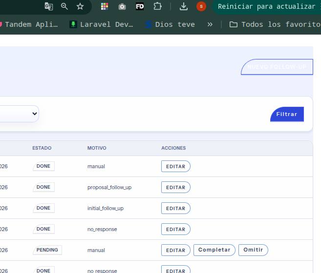
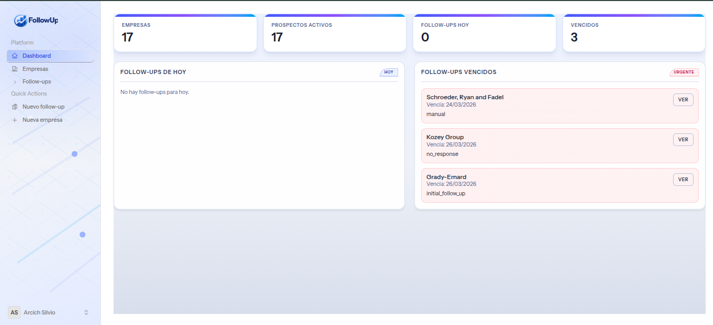
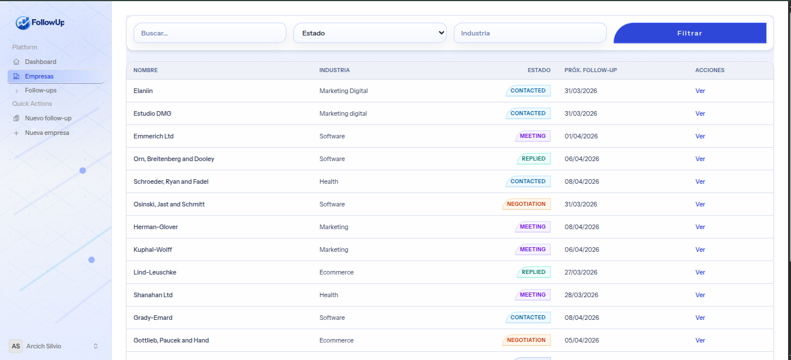
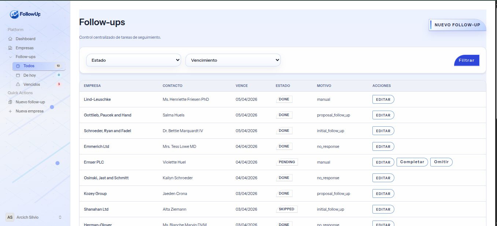
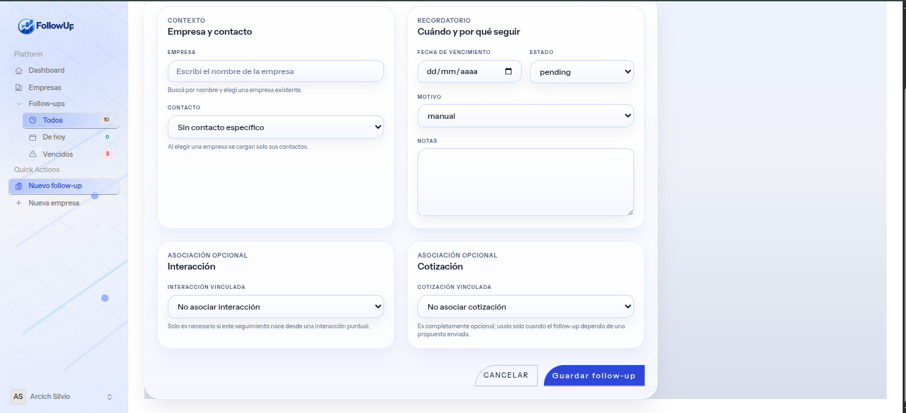
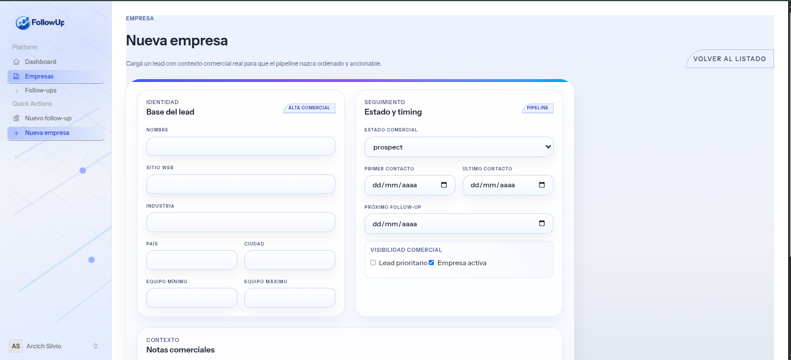
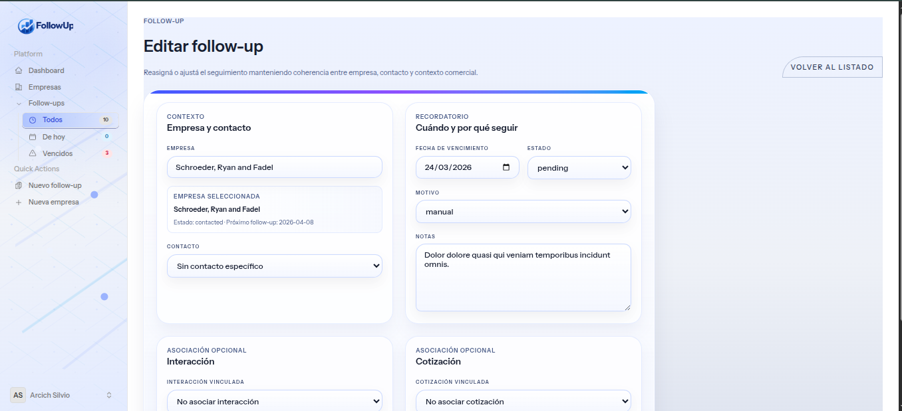
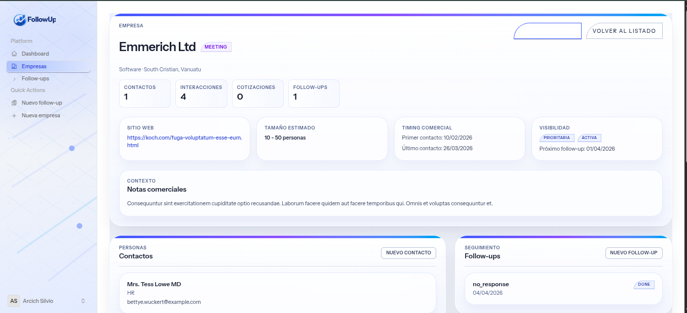
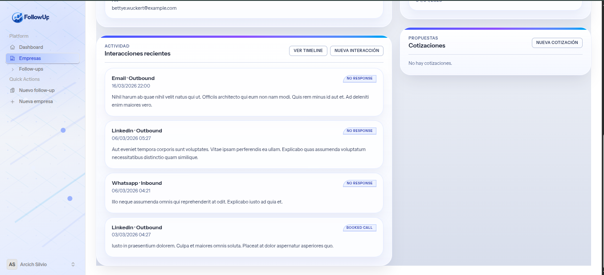

# FollowUp CRM

<p align="center">
  CRM comercial liviano para freelancers, devs y equipos chicos que necesitan ordenar empresas, contactos, interacciones, cotizaciones y seguimientos sin perder contexto.
</p>

<p align="center">
  
  
  
  
  
  
  
  
</p>

## Overview

FollowUp CRM está pensado para centralizar el flujo comercial diario:

- empresas prospectadas
- contactos por empresa
- interacciones comerciales
- follow-ups con vencimiento
- cotizaciones y estado de negociación
- una vista de dashboard para operar el día

La idea del proyecto es simple: que el usuario no tenga que acordarse “de memoria” a quién escribió, cuándo tiene que insistir, ni en qué estado está cada oportunidad.

## Qué resuelve

- Evita perder leads por falta de seguimiento
- Agrupa historial comercial por empresa
- Ordena próximos pasos con follow-ups
- Permite trabajar propuestas y negociación con contexto
- Da una base clara para crecer hacia automatización y scoring

## Funcionalidades actuales

- Dashboard con métricas, follow-ups de hoy y vencidos
- CRUD de empresas
- CRUD de contactos
- Registro de interacciones
- Gestión de cotizaciones
- Gestión de follow-ups
- Timeline comercial por empresa
- Filtros básicos en listados
- Formularios con validación y feedback visual

## Módulos del dominio

- `Companies`
- `Contacts`
- `Contact Channels`
- `Interactions`
- `FollowUps`
- `Quotations`
- `Dashboard`

## Flujo de uso

1. Registrar una empresa.
2. Asociar uno o más contactos.
3. Registrar el primer outreach o interacción.
4. Programar un follow-up.
5. Registrar nuevas respuestas o avances.
6. Enviar una cotización si aplica.
7. Seguir la negociación hasta cerrar, perder o archivar.

## Reglas operativas del producto

- Cada interacción importante debería quedar registrada.
- Cada propuesta enviada debería tener seguimiento asociado.
- El dashboard funciona como punto de entrada diario.
- Los follow-ups están pensados como tareas concretas, no como notas sueltas.

## Estados principales

### Company

- `prospect`
- `contacted`
- `replied`
- `meeting`
- `proposal_sent`
- `negotiation`
- `won`
- `lost`
- `archived`

### Quotation

- `draft`
- `sent`
- `viewed`
- `negotiating`
- `accepted`
- `rejected`
- `expired`

### FollowUp

- `pending`
- `done`
- `skipped`
- `cancelled`

## Stack técnico

- PHP 8.3
- Laravel 13
- Laravel Fortify
- Livewire 4
- Flux UI 2
- Blade
- Tailwind CSS 4
- Vite 8
- Pest 4
- MySQL

## Demo

<p align="center">
  
  
  
</p>

<p align="center">
  
  
  
</p>

<p align="center">
  
  
  
</p>

## Puesta en marcha

### Requisitos

- PHP 8.3+
- Composer
- Node.js 22+
- npm
- MySQL o motor compatible con tu `.env`

### Instalación

```bash
composer install
cp .env.example .env
php artisan key:generate
php artisan migrate:fresh --seed
npm install
npm run build
php artisan serve
```

Si preferís desarrollo con watcher:

```bash
npm run dev
```

## Comandos útiles

```bash
php artisan test --compact
vendor/bin/pint --dirty --format agent
php artisan route:list --except-vendor
```

## Estructura funcional

- `dashboard`: vista operativa principal
- `companies`: alta, edición, detalle y contexto comercial
- `contacts`: personas asociadas a cada empresa
- `interactions`: historial de outreach, respuestas y eventos
- `follow-ups`: tareas futuras, pendientes o vencidas
- `quotations`: propuestas y negociación

## Documentación interna

El proyecto ya incluye documentación adicional en `docs/`:

- [application-flow](docs/application-flow.md)
- [database-design](docs/database-design.md)
- [development-workflow](docs/development-workflow.md)
- [routes-map](docs/routes-map.md)
- [technical-roadmap](docs/technical-roadmap.md)
- [usages-in-real-life](docs/usages-in-real-life.md)
- [codex-context](docs/codex-context.md)

## Roadmap

### Actual

- base CRM funcional
- dashboard operativo
- pipeline comercial inicial
- seguimiento de cotizaciones y tareas

### Próximo

- templates de mensajes
- scoring de leads
- filtros más avanzados
- adjuntos
- automatizaciones de follow-up
- integración con calendario y correo

## Estado del proyecto

Proyecto en evolución activa, orientado a un CRM comercial simple, usable y visualmente diferenciado, construido sobre el stack moderno de Laravel 13 + Livewire.
